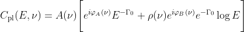

# Complex covariance models

This package implements three `xspec` models for fitting complex covariance
spectra. The three models are

* complex
* covbb
* covpl

See below for more details. 

## Install

Navigate to the install directory and launch `xspec`. Now enter;

	XSPEC> initpackage covmodels lmodel.dat .

This will build the model files in the local directory. To register the
models with `xspec`, simply load the model package using `lmod`
	
	XSPEC> lmod covmodels .

Alternatively, you can configure `xspec` to load the models everytime it is
launched by adding the above command to your user profile. Exit `xspec`, and in the
install folder type;

	echo "lmod covmodels $PWD" >> $HOME/.xspec/xspec.rc

## Usage

The covariance models are defined in the complex plane, and are intended to be
fit jointly to the real and imaginary projections of the data. The output mode
of the covariance models can be controlled through the `ReIm` switch parameter.
This model parameter takes one of three integer values

* 0: Attempt to read the projection mode from the spectrum header
* 1: Calculate the REAL projection of the model
* 2: Calculate the IMAGINARY projection of the model

The easiest way to use these models is to leave the `ReIm` parameter at its default
value of zero, and set the projection mode in the spectrum header file. Given
an imaginary projection spectrum named `cov_im.pha`, this can be done using
the `ftools` as

	fthedit cov_im.pha XFLT0001 add value='reim:2' comment='XSPEC complex imag mode'

The comment is not required, of course, but is good practice. 

### Example 

Say we are given two covariance spectra, `cov_real.pha` and `cov_imag.pha`,
storing the real and imaginary projections of the complex cross covariance.
First, we will want to ensure that the projection modes are stored in the
FITS headers

	fthedit cov_re.pha XFLT0001 add value='reim:1' comment='XSPEC complex real mode'
	fthedit cov_im.pha XFLT0001 add value='reim:2' comment='XSPEC complex imag mode'
	
Now, in `xspec`

	XSPEC> data 1:1 cov_real.pha 2:2 cov_imag.pha
	XSPEC> model phabs * covbb & /*
	XSPEC> show parameters

	Parameters defined:
	========================================================================
	Model phabs<1>*covbb<2> Source No.: 1   Active/On
	Model Model Component  Parameter  Unit     Value
	 par  comp
														 Data group: 1
		 1    1   phabs      nH         10^22    1.00000      +/-  0.0          
		 2    2   covbb      ReIm                0            frozen
		 3    2   covbb      kT         keV      3.00000      +/-  0.0          
		 4    2   covbb      phia       deg      0.0          +/-  0.0          
		 5    2   covbb      phib       deg      0.0          +/-  0.0          
		 6    2   covbb      rho                 5.00000E-02  +/-  0.0          
		 7    2   covbb      norm                1.00000      +/-  0.0          
														 Data group: 2
		 8    1   phabs      nH         10^22    1.00000      = p1
		 9    2   covbb      ReIm                0            = p2
		10    2   covbb      kT         keV      3.00000      = p3
		11    2   covbb      phia       deg      0.0          = p4
		12    2   covbb      phib       deg      0.0          = p5
		13    2   covbb      rho                 5.00000E-02  = p6
		14    2   covbb      norm                1.00000      = p7
	________________________________________________________________________

	XSPEC> fit

That's it. Notice that all parameters are tied between the two spectra - this is intentional.
The underlying model exists in complex space, so it is the same for both
data groups. Only the projections into the real an imaginary planes differ. As
noted, the model (`covbb` in this case) will select the output mode based on
the `ReIm` parameter, which is read automatically from the FITS file header.
If, for whatever reason, you do not want to use the headers, the output mode
can also be set directly in `xspec` as follows

	XSPEC> newpar 2 1
	XSPEC> newpar 9 2
	XSPEC> fit

This will produce the same output. 

## Model information

### complex

An energy independent multiplication factor to embed any model into the complex plane.

Parameter | Name | Description
--------- | ---- | --------------
par1 | ReIm	| complex output switch (0: from header, 1: REAL, 2: IMAG)
par2 | phia	| phase lag 

### covbb

A complex blackbody spectrum with normalization proportional to the surface area (see also
[bbodyrad](https://heasarc.gsfc.nasa.gov/xanadu/xspec/manual/node139.html)). The model
function is given as

with

Parameter | Name | Description
--------- | ---- | --------------
par1 | ReIm	| complex output switch (0: from header, 1: REAL, 2: IMAG)
par2 | kT		| time-averaged blackbody temperature (T₀) in units of keV
par3 | phia	| phase lag of the constant temperature term in units of degrees
par4 | phib	| phase lag of the linear temperature term in units of degrees
par5 | rho	| linear to constant correlation
Norm | A		| R² / D², with R the source radius in km and D source the distance in units of 10 kpc

### covpl

A complex power law spectrum (see also [powerlaw](https://heasarc.gsfc.nasa.gov/xanadu/xspec/manual/node213.html)).
The model function is given as

with

Parameter | Name | Description
--------- | ---- | --------------
par1 | ReIm	| complex output switch (0: from header, 1: REAL, 2: IMAG)
par2 | PhoIndex	| time-averaged photon index (Γ₀)
par3 | phia	| phase lag of the constant photon index term in units of degrees
par4 | phib	| phase lag of the linear photon index term in units of degrees
par5 | rho	| linear to constant correlation
Norm | A	  | normalization in units of photons/keV/cm² at 1 keV

